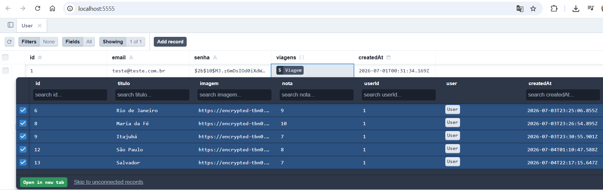
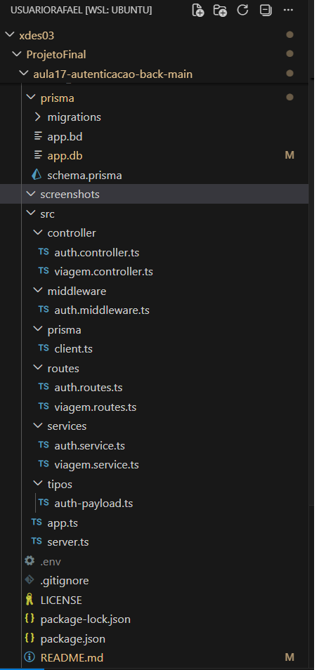
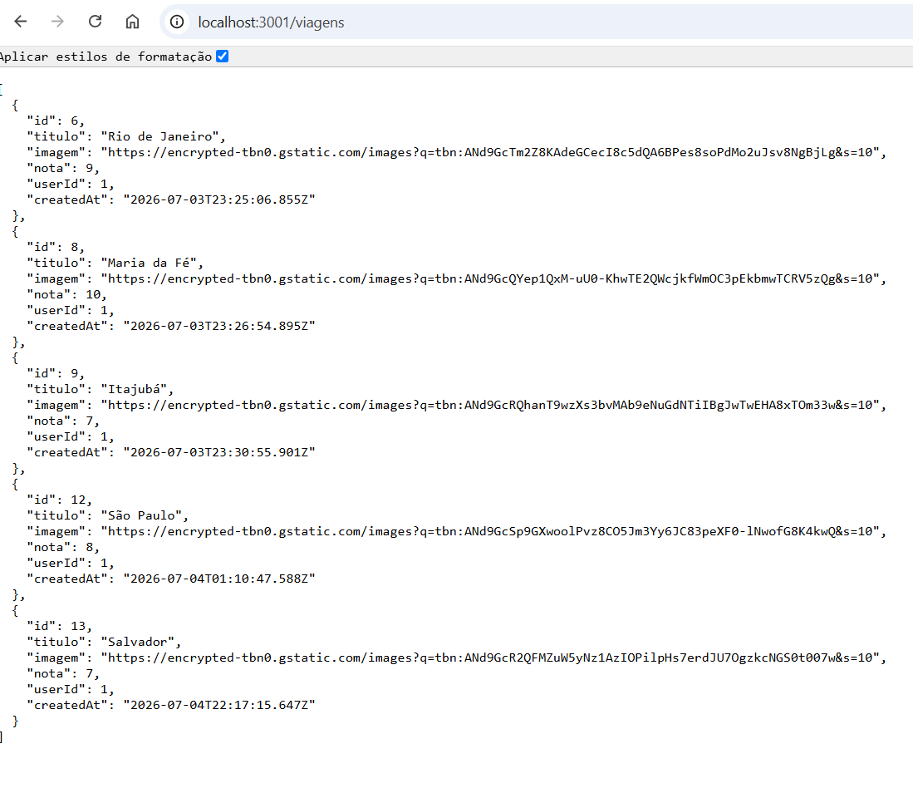

# ✈️ Travel Manager - Backend

Esse repositório contém o backend do sistema **Travel Manager**, desenvolvido utilizando **Node.js**, **Express**, **TypeScript**, **Prisma ORM** e **SQLite**.

O sistema é responsável por disponibilizar a API REST utilizada pelo frontend, realizando autenticação de usuários, gerenciamento das viagens e persistência dos dados no banco de dados.

Além das funcionalidades de CRUD, o projeto implementa autenticação utilizando **JWT**, criptografia de senhas com **bcrypt** e controle de acesso às rotas protegidas.

---

# Funcionalidades

O backend disponibiliza as seguintes funcionalidades:

- Cadastro de usuários
- Login de usuários
- Logout
- Autenticação utilizando JWT
- Geração de Token armazenado em Cookie HttpOnly
- Rotas protegidas por Middleware de autenticação
- Cadastro de viagens
- Consulta de viagens
- Atualização de viagens
- Exclusão de viagens
- Persistência dos dados utilizando Prisma ORM e SQLite

---

# Tecnologias Utilizadas

- Node.js
- Express
- TypeScript
- Prisma ORM
- SQLite
- JWT (JSON Web Token)
- bcrypt
- cookie-parser

---

# Bibliotecas

Para o funcionamento correto do backend execute:

```bash
    npm install
```

Caso seja necessário instalar manualmente:

```bash
    npm install bcrypt
    npm install jsonwebtoken
    npm install cookie-parser
    npm install @prisma/client
```

Dependências de desenvolvimento:

```bash
    npm install -D @types/bcrypt
    npm install -D @types/jsonwebtoken
    npm install -D @types/cookie-parser
    npm install -D prisma
```

### Finalidade das bibliotecas

**bcrypt**

Utilizada para criptografar as senhas antes de armazená-las no banco de dados.

**jsonwebtoken (JWT)**

Responsável pela geração do Token de autenticação utilizado pelo sistema.

**cookie-parser**

Permite ao servidor manipular os Cookies enviados pelo navegador.

**Prisma ORM**

Responsável pela comunicação entre a aplicação e o banco de dados SQLite.

---

# Estrutura do Projeto

```
src
│
├── controller
│   ├── auth.controller.ts
│   └── viagem.controller.ts
│
├── middleware
│   └── auth.middleware.ts
│
├── prisma
│   └── client.ts
│
├── routes
│   ├── auth.routes.ts
│   └── viagem.routes.ts
│
├── services
│   ├── auth.service.ts
│   └── viagem.service.ts
│
├── tipos
│
├── app.ts
└── server.ts
```

---

# Organização da Aplicação

O backend foi dividido em camadas para facilitar a manutenção do código.

### Routes

Recebem as requisições HTTP e encaminham para o Controller correspondente.

### Controllers

Recebem a requisição, extraem os dados enviados pelo cliente (`req.body`, `req.params`, `req.cookies`) e chamam os Services.

### Services

Implementam as regras de negócio da aplicação e realizam o acesso ao banco de dados utilizando Prisma ORM.

### Middleware

Intercepta as requisições protegidas e verifica se o Token JWT é válido antes de permitir o acesso aos recursos da API.

### Prisma

Responsável pela comunicação entre a aplicação e o banco SQLite.

---

# Fluxo da Autenticação

```
Frontend
        │
        ▼
POST /login
        │
        ▼
auth.routes.ts
        │
        ▼
auth.controller.ts
        │
        ▼
auth.service.ts
        │
        ▼
Validação do usuário
        │
        ▼
bcrypt.compare()
        │
        ▼
JWT.sign()
        │
        ▼
Cookie HttpOnly
        │
        ▼
Resposta ao Frontend
```

---

# Fluxo do Cadastro de Viagens

```
Frontend
        │
        ▼
POST /viagens
        │
        ▼
viagem.routes.ts
        │
        ▼
viagem.controller.ts
        │
        ▼
viagem.service.ts
        │
        ▼
Prisma ORM
        │
        ▼
SQLite
```

---

# Banco de Dados

O projeto utiliza **SQLite** como banco de dados e **Prisma ORM** para realizar as operações de persistência.

As tabelas são definidas em:

```
prisma/schema.prisma
```

Após alterações no schema executar:

```bash
    npx prisma migrate dev
    npx prisma generate
```

---

# Arquivo .env

Criar um arquivo `.env` na raiz do projeto contendo:

```env
    DATABASE_URL="file:./app.db"
    JWT_SECRET="seu_token_secreto"
```

Para gerar um JWT_SECRET seguro:

```bash
    node
```

Depois:

```javascript
    require('crypto').randomBytes(64).toString('hex')
```

Copiar o resultado para o `.env`.

Para sair do Node:

```bash
    .exit
```

---

# Execução

Instalar as dependências:

```bash
    npm install
```

Executar as migrations:

```bash
    npx prisma migrate dev
```

Gerar o cliente Prisma:

```bash
    npx prisma generate
```

Executar o servidor:

```bash
    npm run dev
```

Servidor disponível em:

```
    http://localhost:3001
```

---

# Endpoints Principais

## Autenticação

```
POST /auth/create
POST /auth/login
POST /auth/logout
```

## Viagens

```
GET    /viagens
GET    /viagens/:id
POST   /viagens
PUT    /viagens/:id
DELETE /viagens/:id
```

---

# Screenshots

## Prisma Studio



---

## Estrutura do Projeto



---

## Resposta da API



---

# Integrantes

| Integrante | GitHub |
|------------|--------|
| Rafael Ramos da Silva | https://github.com/ramosprof |
| Pedro Henrique Campos | https://github.com/Phpfcampos |

---

# Licença

Projeto desenvolvido para fins acadêmicos na disciplina de Programação Web XDES03.